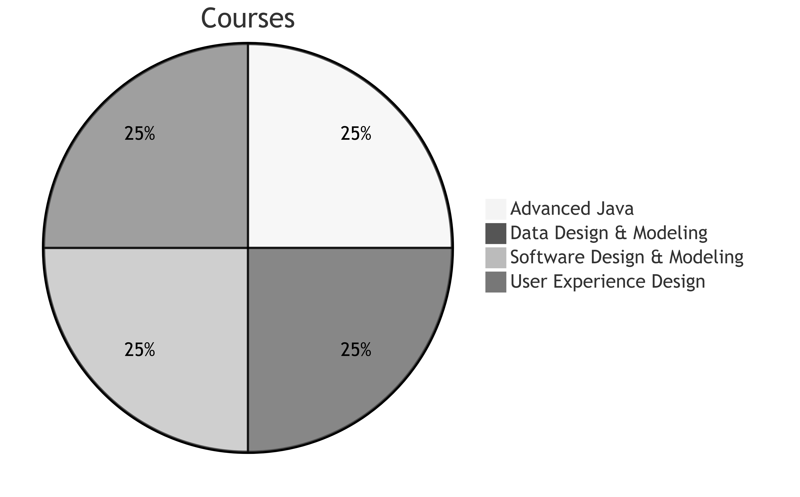
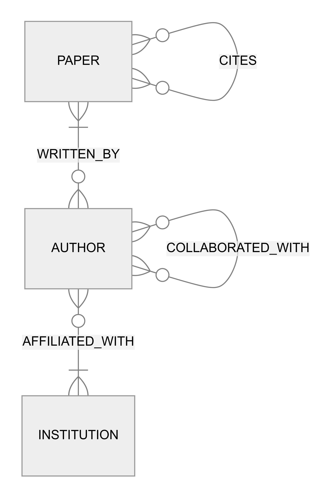

# Academic Research Citation Network

A project to put together the courses I attend at Università della Svizzera italiana.

## Project Goal

I will try to build a website that shows how academic papers cite each other.
This allows for playing around with the following different technologies:

- Maven
- Spring Framework
- Neo4J
- Web applications in Java
- Concurrency in Java

### The Initial ER-Model

Cardinality explained:

| Value (left) | Value (right) | Meaning |
|--------------|---------------|---------|
| \|o          | o\|           | Zero or one |
| \|\|         | \|\|          | Exactly one |
| }o           | o{            | Zero or more (no upper limit) |
| }\|          | \|{           | One or more (no upper limit) |

## Installation

To set up the repo locally, use the instructions in [BUILD_INSTRUCTIONS.md](./resources/BUILD_INSTRUCTIONS.md).

## Contributing

See [CONTRIBUTIONS.md](./resources/CONTRIBUTIONS.md) for guidelines on how to contribute to this project.

## License

This project is licensed under the MIT License. See the LICENSE file for more details.
