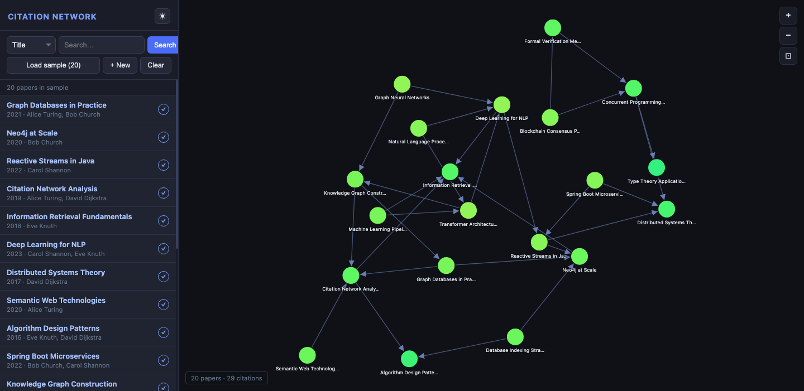
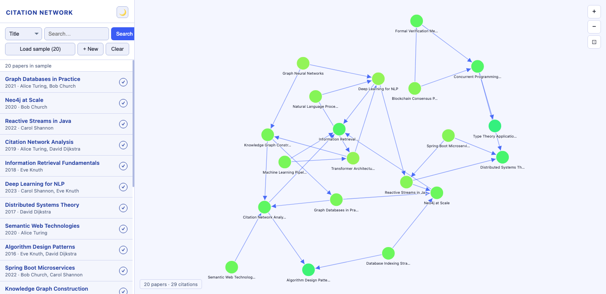
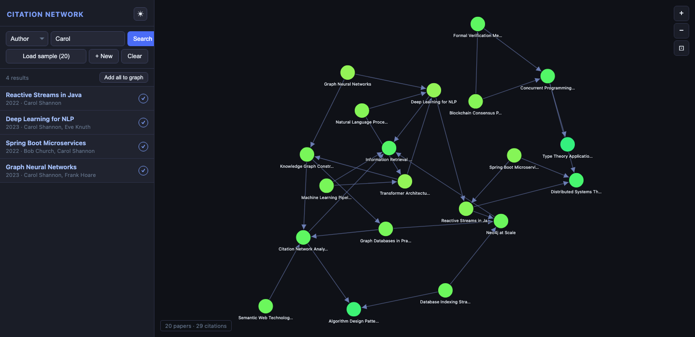
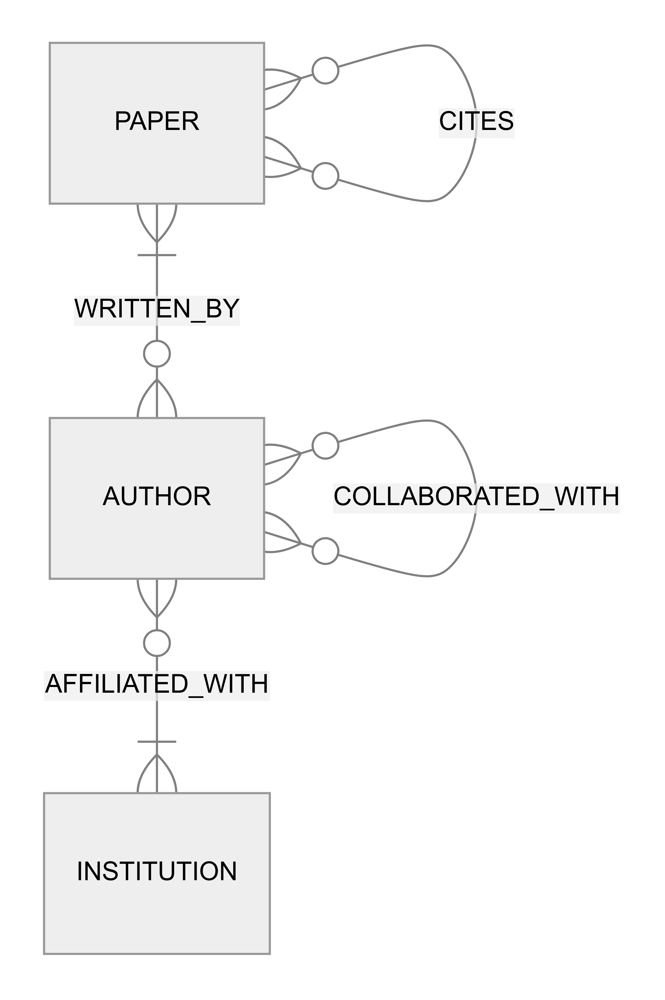

# Academic Citation Network

An interactive graph-based explorer showing how academic papers cite each other. Built at Università della Svizzera italiana to integrate Spring Boot, Neo4j, and D3.js.

---

## Screenshots

**Dark mode — 20 papers, 29 citation edges**



**Light mode**



**Search results — results appear in sidebar; click to add papers individually or press Add all**



---

## Features

| Feature | Description |
|---|---|
| Force-directed graph | D3.js v7 simulation with directional citation arrows, colour-coded by decade |
| Search | By title (partial match), author, publication year, or institution |
| Selective graph building | Search results appear in the sidebar only — click a result to add it to the graph, or press **Add to graph** / **Add all to graph** |
| Source filter tabs | Filter sidebar results by **All**, **Seed**, or **Added** (user-created) papers |
| Expand on demand | **Cited by this** / **Citing this** buttons load connected papers around the selected node |
| Draw citation edges | Hold a node for ~400 ms, then drag to another node to create a citation link |
| Add new paper | Press **+ New** to create a paper (title, year, DOI, authors); optionally paste free text and let AI extract details |
| Bulk import | Open **Bulk** to fetch papers by DOI via CrossRef, or paste free-text references for AI parsing; preview and confirm before committing |
| Find online | Click **Find online** in the detail panel to open the DOI URL in a new tab |
| AI integration | Configure an OpenAI or Anthropic key in **Settings** to enable AI-powered text parsing |
| Light / dark mode | Toggle with the sun/moon button — preference saved in `localStorage` |
| Node detail panel | Click any node to see its DOI, year, authors, and expand/remove actions |
| Zoom & pan | Mouse scroll, +/− buttons, or ⊡ to fit the full graph |
| Configurable sample size | Set how many seed papers to load (1–20) next to the **Load** button |

---

## Tech stack

| Layer | Technology |
|---|---|
| Backend | Spring Boot 3.3.5, Spring WebFlux (reactive, Netty) |
| Database | Neo4j 5 via Spring Data Neo4j (reactive repositories, Flux/Mono) |
| Frontend | Vanilla JS + D3.js v7, served as a static classpath resource |
| Dev server | `mock-server.js` — Node.js mock with 20 papers, no Neo4j needed |
| Tests | JUnit 5, Mockito, `@WebFluxTest`, `@DataNeo4jTest` + embedded neo4j-harness |
| CI | GitHub Actions — compile → test → package, with JUnit XML report upload |

---

## Data model

```
(Paper)-[:CITES]->(Paper)
(Paper)-[:WRITTEN_BY]->(Author)
(Author)-[:AFFILIATED_WITH]->(Institution)
```

### Entities

| Node | Key properties |
|---|---|
| `Paper` | `paperId`, `title`, `publicationYear`, `doi` |
| `Author` | `authorId`, `name` |
| `Institution` | `institutionId`, `name`, `location` |

### Original ER model



---

## REST API

| Method | Path | Description |
|---|---|---|
| `GET` | `/papers?limit={n}` | First *n* papers (default 20) |
| `GET` | `/papers/title/{title}` | Paper whose title contains the query |
| `GET` | `/papers/author/{name}` | Papers by author name |
| `GET` | `/papers/year/{year}` | Papers by publication year |
| `GET` | `/papers/institution/{name}` | Papers by institution |
| `GET` | `/papers/{id}/cited-by` | Papers that this paper cites |
| `GET` | `/papers/{id}/citing` | Papers that cite this paper |
| `POST` | `/papers` | Create a paper (JSON body) |
| `POST` | `/papers/{citingId}/cites/{citedId}` | Add a citation edge |
| `DELETE` | `/papers/{id}` | Delete a paper |
| `GET` | `/authors/coauthors/{name}` | Co-authors of the given author |

---

## Running

### Option A — Frontend only (no Neo4j required)

A Node.js mock server serves the UI and fakes all API endpoints with 20 sample papers and 29 citation edges.

```bash
node mock-server.js
# Open http://localhost:8080
```

In Claude Code the **cite-network-ui** launch configuration (`.claude/launch.json`) starts this automatically from the Preview panel.

### Option B — Full stack (Spring Boot + Neo4j)

**Prerequisites:** Java 23+, Maven, Neo4j 5.

1. Set Neo4j credentials in `src/main/resources/application.properties`:

   ```properties
   spring.neo4j.uri=bolt://localhost:7687
   spring.neo4j.authentication.username=neo4j
   spring.neo4j.authentication.password=your-password
   ```

2. Start the app:

   ```bash
   mvn spring-boot:run
   # Open http://localhost:8080
   ```

### Option C — Docker Compose

```bash
docker-compose up
# Open http://localhost:8080
```

---

## Tests

Tests use the embedded Neo4j harness — **no external database required**.

```bash
mvn verify
```

| Layer | Annotation | Tests |
|---|---|---|
| Repository | `@DataNeo4jTest` + harness | Cypher queries against a real in-process Neo4j |
| Service | `@ExtendWith(MockitoExtension.class)` | Business logic with mocked repositories |
| Controller | `@WebFluxTest` + `@MockBean` | HTTP routing, status codes, response shapes |

---

## CI

GitHub Actions runs on every push and every PR targeting `main`:

```
Checkout → Set up JDK 23 → Compile → Test → Upload surefire reports (7 days)
         → Package → Upload JAR artifact (14 days) → Test summary
```

The embedded Neo4j harness means CI needs no database service container.
Test results are uploaded as surefire XML artifacts and rendered as a job summary via `test-summary/action@v2`.

---

## Contributing

See [CONTRIBUTIONS.md](./resources/CONTRIBUTIONS.md) for contribution guidelines.

## License

MIT — see the LICENSE file for details.
